# 📚 STUDYBUD - Community Discussion Platform


---

## 📋 Table of Contents
- [Overview](#overview)
- [Tech Stack](#tech-stack)
- [Key Features](#key-features)
- [Database Architecture](#database-architecture)
- [Project Structure](#project-structure)
- [Application Flow](#application-flow)
- [URL Routes](#api-endpoints)
- [Screenshots](#screenshots)
- [Configuration](#configuration)
- [Development Concepts Demonstrated](#development-concepts-demonstrated)

---

## Overview

**STUDYBUD** is a community-driven discussion platform built with Django, where users can create and join topic-based discussion rooms. The platform facilitates knowledge sharing and collaboration by enabling users to:

- Create discussion rooms on various topics
- Join existing rooms and participate in conversations
- Send and manage messages within rooms
- Create and customize user profiles
- Browse topics and recent activities
- Track room participants

**Live URL**: [https://mysite-3zm8.onrender.com/](https://mysite-3zm8.onrender.com/)

This application demonstrates core Django concepts including authentication, database relationships, CRUD operations, REST API development, and deployment configuration.

---

## 🛠️ Tech Stack

### Backend Framework
```
┌─────────────────────────────────────┐
│         Django 6.0                  │
│  Python Web Framework               │
└─────────────────────────────────────┘
```

### Core Technologies

| Category | Technology | Version | Purpose |
|----------|-----------|---------|---------|
| **Framework** | Django | 6.0 | Main web framework |
| **API** | Django REST Framework | 3.16.1 | RESTful API development |
| **Database** | PostgreSQL | - | Production database (via psycopg2-binary 2.9.11) |
| **Storage** | Cloudinary | 1.44.1 | Media file storage |
| **Server** | Gunicorn | 23.0.0 | WSGI HTTP Server |
| **Server** | Uvicorn | 0.40.0 | ASGI server |
| **Static Files** | WhiteNoise | 6.11.0 | Static file serving |
| **Image Processing** | Pillow | 12.0.0 | Image handling |
| **CORS** | django-cors-headers | 4.9.0 | Cross-Origin Resource Sharing |

### Additional Dependencies
- **asgiref** (3.11.0) - ASGI specification implementation
- **dj-database-url** (3.0.1) - Database configuration via URL
- **django-cloudinary-storage** (0.3.0) - Cloudinary integration
- **requests** (2.32.5) - HTTP library
- **GitPython** (3.1.45) - Git integration

---

## Key Features

### 1. User Authentication System
- **Custom User Registration**: Users can signUp with their mail-id and create a unique username
- **Email-based Login**: Users can login with their email-id and password
- **Logout Functionality**
- **Password Validation**

### 2. Room Management
- **Create Rooms**: Users can create discussion rooms with topics
- **Update Rooms**: Room hosts can edit room details
- **Delete Rooms**: Room hosts can delete their rooms
- **Join Rooms**: Users automatically become participants when messaging
- **Room Filtering**: Search rooms by topic, name, or description

### 3. Messaging System
- Real-time message posting in rooms
- Message deletion by message owner
- Message display with timestamps
- Recent activity tracking

### 4. User Profiles
- Custom user profiles with avatar support
- Bio and personal information
- User activity history
- Profile update functionality

### 5. Topic Browsing
- View all topics
- Filter rooms by topic
- Topic-based search functionality

### 6. Recent Activity Feed
- Global activity stream
- Topic-filtered activities
- User-specific activity tracking

### 7. REST API
- Room listing endpoint
- Individual room details

---

## Database Architecture

### Entity Relationship Diagram

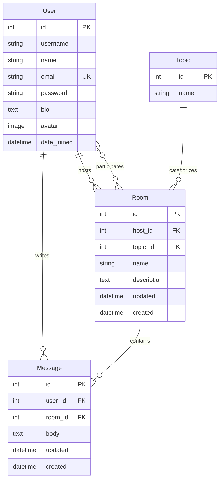

### Model Details

#### 1. User Model (Custom AbstractUser)
```python
Fields:
- username: CharField (inherited)
- name: CharField(max_length=200, null=True)
- email: EmailField(unique=True, null=True) - Used for login
- bio: TextField(null=True)
- avatar: ImageField(default="avatar.svg", upload_to="images/")
- password: CharField (inherited)

Authentication: Email-based (USERNAME_FIELD = 'email')
```

#### 2. Topic Model
```python
Fields:
- id: AutoField (Primary Key)
- name: CharField(max_length=200)

Purpose: Categorize discussion rooms
```

#### 3. Room Model
```python
Fields:
- id: AutoField (Primary Key)
- host: ForeignKey(User, on_delete=SET_NULL)
- topic: ForeignKey(Topic, on_delete=SET_NULL)
- name: CharField(max_length=200)
- description: TextField(blank=True)
- participants: ManyToManyField(User, related_name='participants')
- updated: DateTimeField(auto_now=True)
- created: DateTimeField(auto_now_add=True)

Ordering: Most recently updated first
```

#### 4. Message Model
```python
Fields:
- id: AutoField (Primary Key)
- user: ForeignKey(User, on_delete=CASCADE)
- room: ForeignKey(Room, on_delete=CASCADE)
- body: TextField
- updated: DateTimeField(auto_now=True)
- created: DateTimeField(auto_now_add=True)

Display: First 25 characters + "..."
```

---

## Project Structure

```
STUDYBUD/
│
├── 📁 studybud/                    # Main project directory
│   ├── __init__.py
│   ├── settings.py                # Project settings & configuration
│   ├── urls.py                    # Main URL configuration
│   ├── asgi.py                    # ASGI configuration
│   └── wsgi.py                    # WSGI configuration
│
├── 📁 base/                        # Main application
│   ├── 📁 api/                     # REST API implementation
│   │   ├── __init__.py
│   │   ├── serializers.py         # API serializers
│   │   ├── views.py               # API views
│   │   └── urls.py                # API URL routing
│   │
│   ├── 📁 migrations/              # Database migrations
│   │   ├── __init__.py
│   │   └── 0001_initial.py        # Initial migration
│   │
│   ├── 📁 templates/base/          # HTML templates
│   │   ├── home.html              # Main landing page
│   │   ├── login_register.html    # Authentication page
│   │   ├── room.html              # Room detail page
│   │   ├── room_form.html         # Room creation/editing form
│   │   ├── profile.html           # User profile page
│   │   ├── update-user.html       # Profile update form
│   │   ├── delete.html            # Deletion confirmation
│   │   ├── topics.html            # Topics listing page
│   │   ├── activity.html          # Activity feed page
│   │   ├── feed_component.html    # Feed component
│   │   ├── topics_component.html  # Topics sidebar component
│   │   └── activity_component.html # Activity component
│   │
│   ├── __init__.py
│   ├── models.py                  # Database models
│   ├── views.py                   # View functions
│   ├── urls.py                    # App URL routing
│   ├── forms.py                   # Form classes
│   ├── admin.py                   # Admin configuration
│   ├── apps.py                    # App configuration
│   └── tests.py                   # Test cases
│
├── 📁 templates/                   # Global templates
│   ├── main.html                  # Base template
│   └── navbar.html                # Navigation bar
│
├── 📁 static/                      # Static files
│   ├── 📁 images/                  # Image assets
│   │   ├── logo.svg
│   │   ├── avatar.svg
│   │   ├── favicon.ico
│   │   └── 📁 icons/              # UI icons
│   ├── 📁 styles/                  # CSS files
│   │   ├── style.css              # Main stylesheet
│   │   └── main.css
│   └── 📁 js/                      # JavaScript files
│       └── script.js              # Main script
│
├── 📁 staticfiles/                 # Collected static files (production)
│
├── manage.py                       # Django management script
├── requirements.txt                # Python dependencies
├── build.sh                        # Build script for deployment
└── render.yaml                     # Render deployment configuration
```

---

## Application Flow

### 1. User Authentication Flow

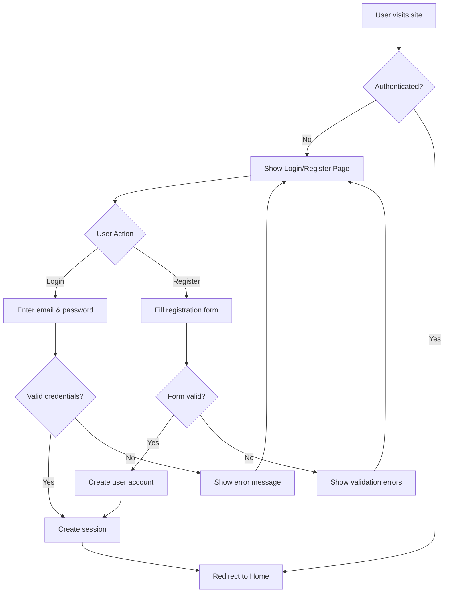

### 2. Room Creation and Discussion Flow

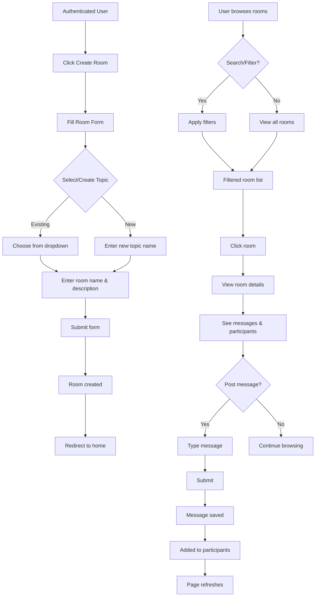

### 3. Message Management Flow

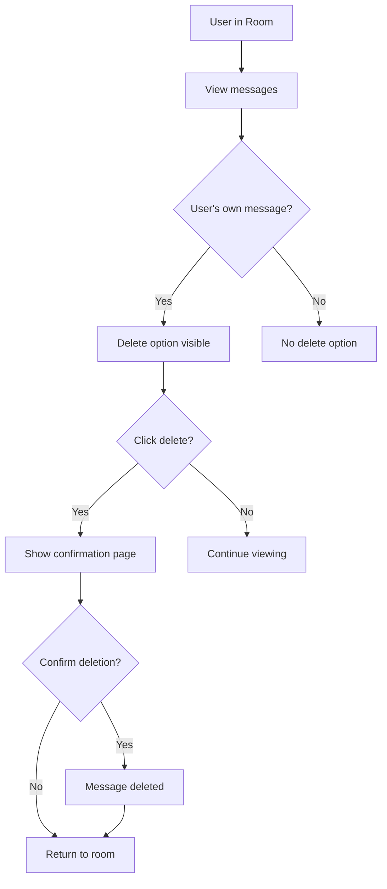

### 4. Profile Management Flow

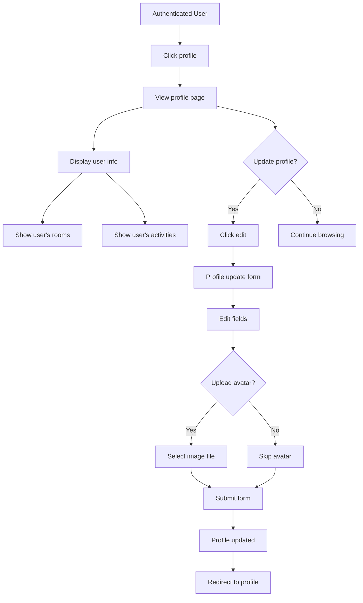

### 5. Room Update/Delete Flow

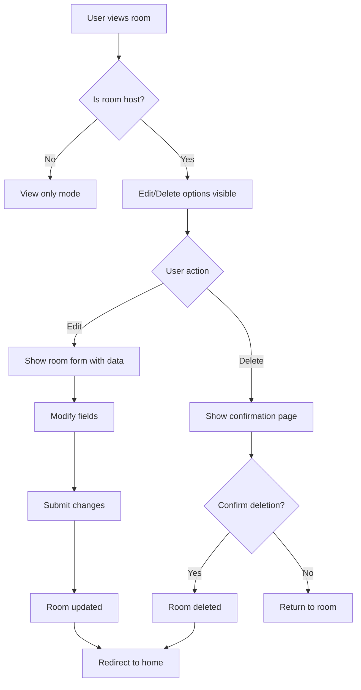

---

## URL Routes

### URL Structure
```
Main App: base-url/
API: base-url/api/
Admin: base-url/admin/
```

### Web Application Routes

| Method | Endpoint | View Function | Purpose | Auth Required |
|--------|----------|--------------|---------|---------------|
| GET/POST | `/login/` | `loginPage` | User login | No |
| GET | `/logout/` | `logoutUser` | User logout | No |
| GET/POST | `/register/` | `registerUser` | User registration | No |
| GET | `/` | `home` | Home page with rooms | No |
| GET/POST | `/room/<pk>/` | `room` | Room detail & messaging | No |
| GET | `/profile/<pk>/` | `userProfile` | User profile | No |
| GET/POST | `/create-room/` | `createRoom` | Create new room | Yes |
| GET/POST | `/update-room/<pk>/` | `updateRoom` | Update room | Yes (Host only) |
| GET/POST | `/delete-room/<pk>/` | `deleteRoom` | Delete room | Yes (Host only) |
| GET/POST | `/delete-message/<pk>/` | `deleteMessage` | Delete message | Yes (Owner only) |
| GET/POST | `/update-user/` | `updateUser` | Update user profile | Yes |
| GET | `/topics/` | `topicsPage` | Topics listing | No |
| GET | `/activities/` | `activitiesPage` | Activities feed | No |

### REST API Routes

| Method | Endpoint | View Function | Response | Auth Required |
|--------|----------|--------------|----------|---------------|
| GET | `/api/` | `getRoutes` | List of available API routes | No |
| GET | `/api/rooms/` | `getRooms` | List of all rooms (JSON) | No |
| GET | `/api/room/<pk>/` | `getRoom` | Single room details (JSON) | No |

### API Response Examples

#### GET /api/rooms/
```json
[
    {
        "id": 1,
        "host": 2,
        "topic": 3,
        "name": "Django Best Practices",
        "description": "Discuss Django development patterns",
        "participants": [2, 5, 8],
        "updated": "2025-02-13T10:30:00Z",
        "created": "2025-02-10T14:20:00Z"
    }
]
```

#### GET /api/room/1/
```json
{
    "id": 1,
    "host": 2,
    "topic": 3,
    "name": "Django Best Practices",
    "description": "Discuss Django development patterns",
    "participants": [2, 5, 8],
    "updated": "2025-02-13T10:30:00Z",
    "created": "2025-02-10T14:20:00Z"
}
```

---

## Screenshots

### Home Page
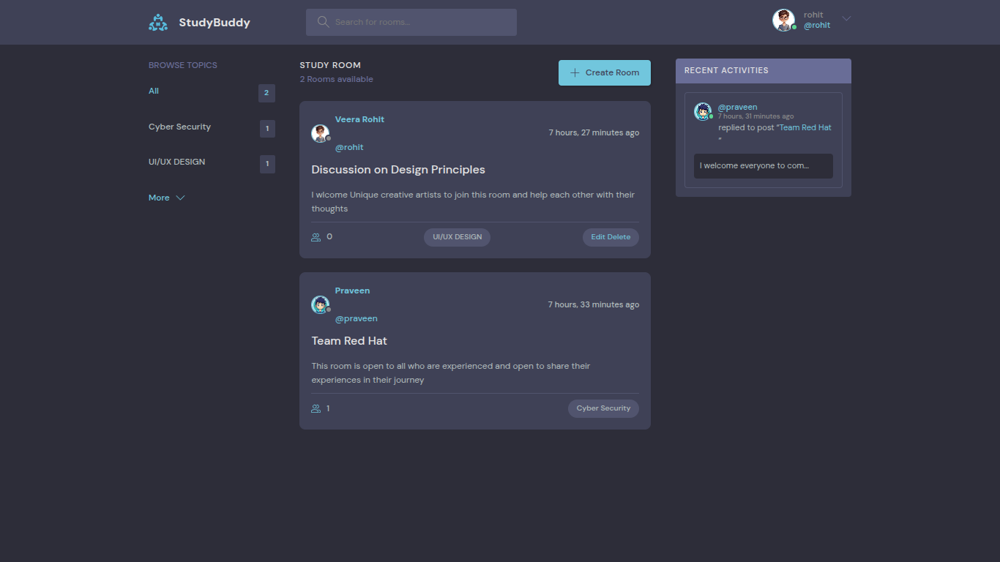
*Main landing page showing available rooms, topics, and recent activities*

### Room Detail
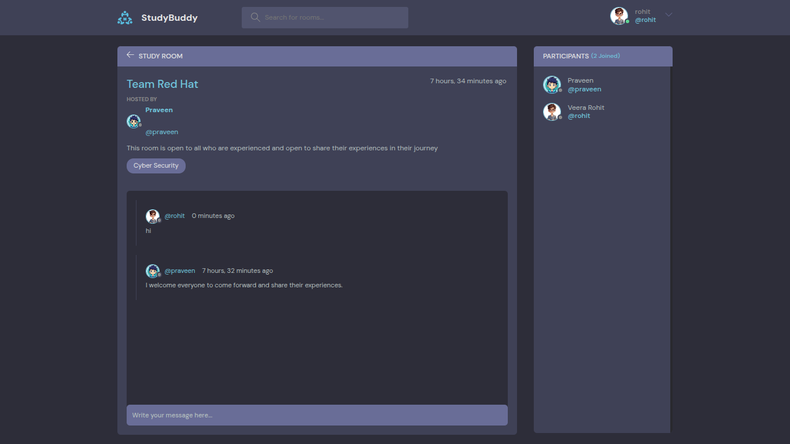
*Discussion room showing messages and participants*

### Login/Register
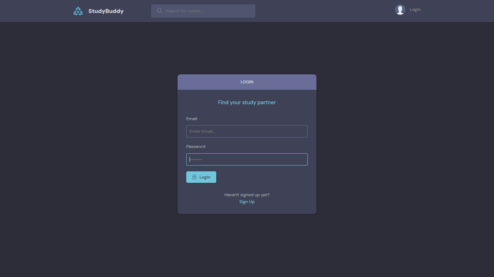
*User authentication interface*

### Create Room
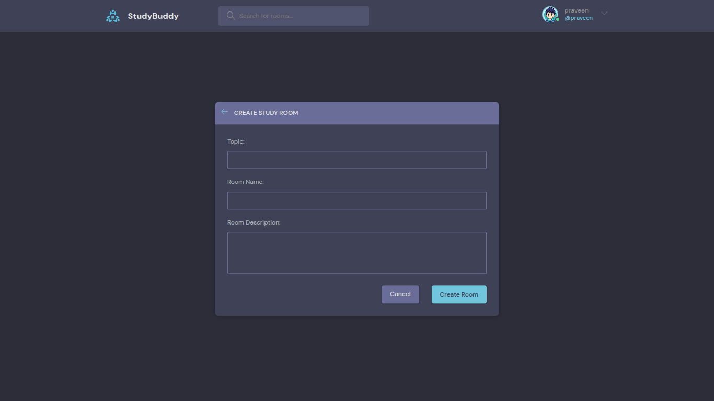
*Room creation form with topic selection*

### User Profile
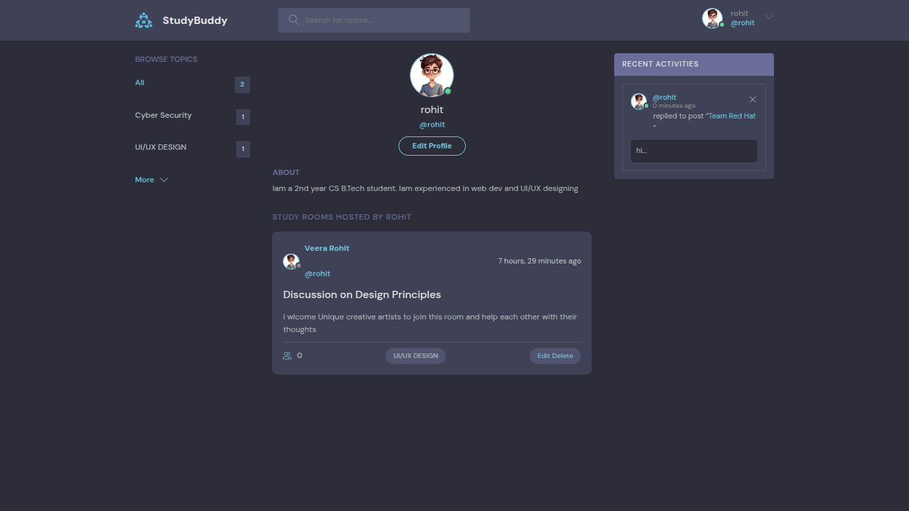
*User profile showing rooms and activities*

### Topics Page
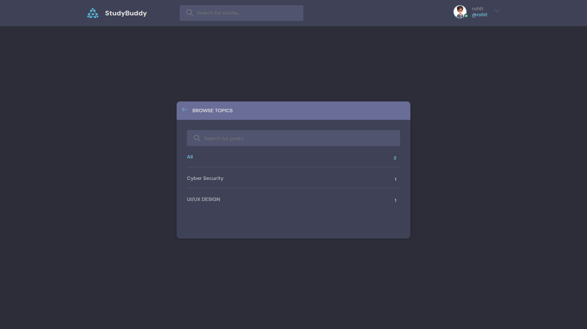
*Browse all discussion topics*


---

## Configuration

### Settings Overview

#### 1. Authentication
```python
# Custom user model
AUTH_USER_MODEL = 'base.User'

# Email-based authentication
USERNAME_FIELD = 'email'
```

#### 2. Database
```python
# Production: PostgreSQL via environment variable
DATABASES = {
    'default': dj_database_url.config(
        default=os.environ.get('DATABASE_URL'),
        conn_max_age=600,
        ssl_require=True
    )
}
```

#### 3. Static Files
```python
# Static files configuration
STATIC_URL = '/static/'
STATIC_ROOT = BASE_DIR / "staticfiles"
STATICFILES_DIRS = [os.path.join(BASE_DIR, 'static')]

# WhiteNoise for static file serving
STATICFILES_STORAGE = 'whitenoise.storage.StaticFilesStorage'
```

#### 4. Media Files
```python
# Cloudinary for media storage
DEFAULT_FILE_STORAGE = 'cloudinary_storage.storage.MediaCloudinaryStorage'
MEDIA_URL = '/images/'
MEDIA_ROOT = BASE_DIR / 'static/images'
```

#### 5. CORS Configuration
```python
# Allow all origins (development)
CORS_ALLOW_ALL_ORIGINS = True
```

#### 6. Installed Apps
```python
INSTALLED_APPS = [
    'django.contrib.admin',
    'django.contrib.auth',
    'django.contrib.contenttypes',
    'django.contrib.sessions',
    'django.contrib.messages',
    'django.contrib.staticfiles',
    'cloudinary_storage',      # Media file storage
    'cloudinary',              # Cloudinary integration
    'base.apps.BaseConfig',    # Main application
    'rest_framework',          # REST API
    'corsheaders',             # CORS handling
]
```

---

## Development Concepts Demonstrated

### Django Concepts Applied

1. **MVT Architecture**
   - Models: Database schema definition
   - Views: Business logic and request handling
   - Templates: HTML rendering with Django template language

2. **ORM (Object-Relational Mapping)**
   - Model relationships (ForeignKey, ManyToManyField)
   - QuerySet API usage
   - Database queries with Q objects

3. **Authentication System**
   - Custom user model extending AbstractUser
   - Login/logout functionality
   - User registration
   - Login required decorators

4. **Forms Handling**
   - ModelForm usage
   - Form validation
   - File upload handling (avatars)

5. **URL Routing**
   - URL patterns
   - Named URLs
   - URL parameters

6. **Template Inheritance**
   - Base templates
   - Template blocks
   - Template includes
   - Context processors

7. **Static and Media Files**
   - Static file serving
   - Media file uploads
   - Cloudinary integration
   - WhiteNoise configuration

8. **Admin Interface**
   - Model registration
   - Admin customization

9. **REST API Development**
   - Django REST Framework
   - Serializers
   - API views

10. **Deployment Configuration**
    - Production settings
    - Database configuration
    - Server setup (Gunicorn/Uvicorn)
    - Build scripts

---

## Future Development

*This section will be updated as new features are added*

Potential features under consideration:
- Real-time messaging with WebSockets
- Direct messaging between users
- Room categories and tagging
- Search functionality enhancements
- User notifications system
- File sharing in rooms
- Room moderation features
- User following system
- Mobile responsive improvements

---

## License

This is an educational project developed for learning purposes.

---

## Contributing

As this is a personal learning project, it is not currently open for contributions. However, feedback and suggestions are welcome!


> **Note:** This project is developed as a learning initiative to enhance my skills in Django web development. It is currently under continuous development with new features being added regularly.


---


